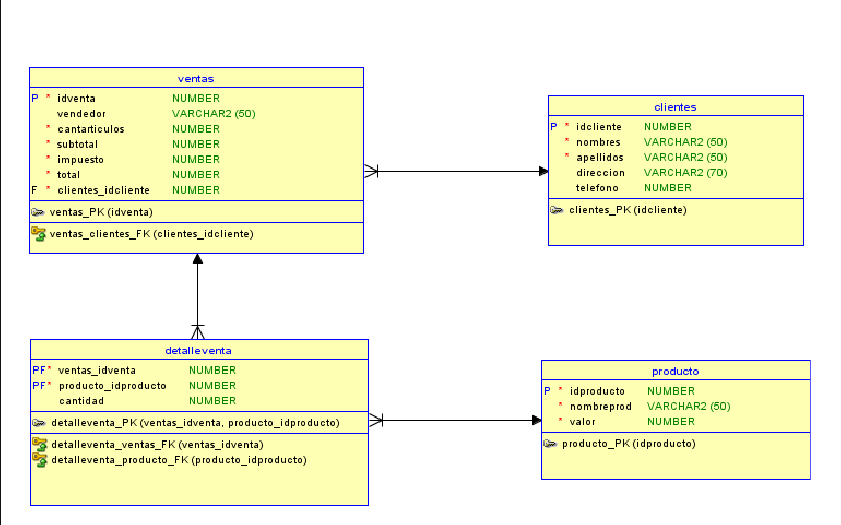

# M3-ABP_8

## CREAR BASE DE DATOS

    CREATE DATABASE MINORISTA;

## SELECCIONAR BD MINORISTA

    USE MINORISTA;

## CREAR TABLA ventas

    CREATE TABLE ventas(
        idVenta INT NOT NULL PRIMARY KEY,
        vendedor VARCHAR(50) NULL,
        cantArticulos INT NOT NULL,
        subTotal INT NOT NULL,
        impuesto INT NOT NULL,
        total INT NOT NULL,
        clientes_idCliente INT
    );

## CREAR TABLA clientes

    CREATE TABLE clientes(
        idCliente INT NOT NULL PRIMARY KEY,
        nombres VARCHAR(50) NOT NULL,
        apellidos VARCHAR(50) NOT NULL,
        direccion VARCHAR(70),
        telefono INT
    );

## CREAR TABLA producto

    CREATE TABLE producto(
        idProducto INT NOT NULL PRIMARY KEY,
        nombreProd VARCHAR(50) NOT NULL,
        valor INT NOT NULL
    );

## CREAR TABLA detalleVenta

    CREATE TABLE detalleVenta(
        ventas_idVenta INT NOT NULL,
        producto_idProducto INT NOT NULL,
        cantidad INT NULL,
        PRIMARY KEY (ventas_idVenta, producto_idProducto)
    );

## Crear FK entre tabla ventas y clientes

    ALTER TABLE ventas
    ADD FOREIGN KEY (clientes_idCliente)
    REFERENCES clientes (idCliente);

*Aquí tenemos un problema, no está nombrada correctamente la llave foránea así que borraremos y crearemos otra vez la FK El nombre predeterminado de esta relación, en particular, es ventas_ibfk_1*:

    ALTER TABLE ventas
    DROP FOREIGN KEY ventas_ibfk_1;

## CREAR OTRA VEZ LA LLAVE FORÁNEA

    ALTER TABLE ventas
    ADD CONSTRAINT ventas_cliente_FK
    FOREIGN KEY (clientes_idCliente) REFERENCES clientes(idCliente);

## Crear FK entre detalleVenta y producto

    ALTER TABLE detalleVenta
    ADD CONSTRAINT detalleVenta_ventas_FK
    FOREIGN KEY (ventas_idVenta) REFERENCES ventas(idVenta),

    ADD CONSTRAINT detalleVenta_producto_FK
    FOREIGN KEY (producto_idProducto) REFERENCES producto(idProducto);
    ;

## INGRESO DE DATA EN TABLA clientes

    INSERT INTO clientes
    (idCliente, nombres, apellidos, direccion, telefono)
    values
    (1, 'Frijolito', 'Chupito', 'En mi casa', 555555),
    (2, 'Garbancito','Firulais', 'En su casa', 6666666)
    ;

    INSERT INTO clientes
    (idCliente, nombres, apellidos)
    values
    (3, 'Chuletas', 'Dinamita')
    ;

## POBLAR DATA EN TABLA ventas

    INSERT INTO ventas
    (idVenta, vendedor, cantArticulos, subTotal, impuesto, total, clientes_idCliente)
    values
    (1, 'Aitor Tilla', 5, 4500, 41, 78522, 1 ),
    (2, 'Alan Brito Delgado', 7, 78421, 9855, 987986, 2),
    (3, 'Aitor Tilla', 60, 96599, 25698, 102354, 3),
    (4, 'Alan Brito Delgado', 9, 87798, 36297, 362541,1),
    (5, 'Evita Dolores', 20, 45656, 85, 999877,2)
    ;

## ACTIVIDADES

1.- Genere una restricción de tipo única para el campo nombreprod de la tabla producto.

    ALTER TABLE producto
    MODIFY COLUMN nombreProd VARCHAR(50) NULL UNIQUE;

2.- Genere las consultas para convertir el campo idproducto en un campo de tipo
autoincremental.

    SET FOREIGN_KEY_CHECKS = 0;
    ALTER TABLE producto
    CHANGE COLUMN idProducto idProducto INT NOT NULL AUTO_INCREMENT;
    SET FOREIGN_KEY_CHECKS = 1;

**IMPORTANTE: LAS SIGUIENTES ACTIVIDADES SE DEBEN EJECUTAR JUNTAS**
3.- Genere las consultas para insertar cuatro productos en la base de datos. Recuerde hacer
uso de la secuencia.
4.- Genere las consultas para insertar ocho registros en la tabla detalleventa.
5.- Finalmente, incluya una sentencia de confirmación de la acción.

    START TRANSACTION;
    SET autocommit = 0;
    
    INSERT INTO producto
    (nombreProd, valor)
    VALUES
    ('PINTURA ACRÍLICA VERDE', 28999),
    ('ESMALTE AL AGUA AZUL', 25999),
    ('LÁTEX ROJO', 14566),
    ('ÓLEO SINTETICO', 65254);

*MOSTRAR LA DATA DE LA TABLA PRODUCTO ANTES DEL COMMIT:*

    SELECT * FROM producto;

    INSERT INTO detalleVenta
    (ventas_idVenta, producto_idProducto)
    VALUES
    (1, 1),
    (3, 2),
    (4, 1),
    (1, 2),
    (3, 3),
    (4, 4),
    (4, 2),
    (3, 1);

*MOSTRAR LA DATA DE LA TABLA DETALLEVENTA ANTES DEL COMMIT*:

    SELECT * FROM detalleVenta;
    COMMIT;
    SET autocommit = 1;

*MOSTRAR EL RESULTADO DESPUÉS DEL COMMIT*:

    SELECT * FROM producto;
    SELECT * FROM detalleVenta;
