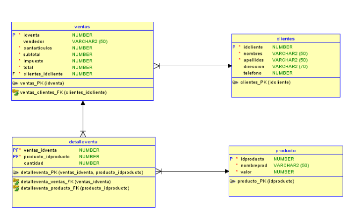
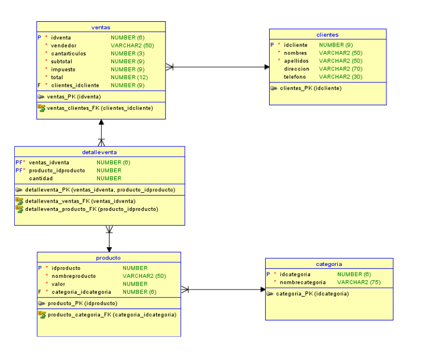

# M3-ABP_9

## Diseño de BD Original

## Diseño de BD Final

## CREAR BASE DE DATOS

    CREATE DATABASE ABP_9_MINORISTA;

## USAR BASE DE DATOS

    USE ABP_9_MINORISTA;

## CREAR TABLA ventas

    CREATE TABLE ventas(
        idVenta INT NOT NULL PRIMARY KEY,
        vendedor VARCHAR(50) NULL,
        cantArticulos INT NOT NULL,
        subTotal INT NOT NULL,
        impuesto INT NOT NULL,
        total INT NOT NULL,
        clientes_idCliente INT NOT NULL
    );

## CREAR TABLA clientes

    CREATE TABLE clientes(
        idCliente INT NOT NULL PRIMARY KEY,
        nombres VARCHAR(50) NOT NULL,
        apellidos VARCHAR(50) NOT NULL,
        direccion VARCHAR(70),
        telefono INT
    );

## CREAR TABLA detalleVenta

    CREATE TABLE detalleVenta(
        ventas_idVenta INT NOT NULL,
        producto_idProducto INT NOT NULL,
        cantidad INT NULL,
        PRIMARY KEY (ventas_idVenta, producto_idProducto)
    );

## CREAR TABLA producto

    CREATE TABLE producto(
        idProducto INT NOT NULL PRIMARY KEY,
        nombreProd VARCHAR(50) NOT NULL,
        valor INT NOT NULL
    );

## CREAR FK ventas CON clientes

    ALTER TABLE ventas
    ADD CONSTRAINT ventas_clientes_FK
    FOREIGN KEY (clientes_idCliente) REFERENCES clientes(idCliente);

## CREAR FK detalleVentas CON ventas Y detalleVentas CON producto

    ALTER TABLE detalleVenta
    ADD CONSTRAINT detalleVenta_ventas_FK
    FOREIGN KEY (ventas_idVenta) REFERENCES ventas(idVenta),

    ADD CONSTRAINT  detalleVenta_producto_FK
    FOREIGN KEY (producto_idProducto) REFERENCES producto(idProducto);

*Luego de una serie de cambios, la bd ha quedado de la siguiente manera:*

## MODIFICACIÓN DE TABLA ventas

    ALTER TABLE ventas
    MODIFY COLUMN idVenta INT(6) NOT NULL,
    MODIFY COLUMN vendedor VARCHAR(50) NOT NULL,
    MODIFY COLUMN cantArticulos INT(3) NOT NULL,
    MODIFY COLUMN subTotal INT(9) NOT NULL,
    MODIFY COLUMN impuesto INT(9) NOT NULL,
    MODIFY COLUMN total INT(12) NOT NULL,
    MODIFY COLUMN clientes_idCliente INT(9) NOT NULL;

    +TABLA ventas:
    +--------------------+-------------+------+-----+---------+-------+
    | Field              | Type        | Null | Key | Default | Extra |
    +--------------------+-------------+------+-----+---------+-------+
    | idVenta            | int         | NO   | PRI | NULL    |       |
    | vendedor           | varchar(50) | NO   |     | NULL    |       |
    | cantArticulos      | int         | NO   |     | NULL    |       |
    | subTotal           | int         | NO   |     | NULL    |       |
    | impuesto           | int         | NO   |     | NULL    |       |
    | total              | int         | NO   |     | NULL    |       |
    | clientes_idCliente | int         | NO   | MUL | NULL    |       |
    +--------------------+-------------+------+-----+---------+-------+
    7 rows in set (0,01 sec)

## MODIFICACIÓN DE TABLA clientes

    ALTER TABLE clientes
    MODIFY COLUMN idCliente INT(9) NOT NULL,
    MODIFY COLUMN telefono VARCHAR(30) NULL;

    +TABLA clientes:
    +-----------+-------------+------+-----+---------+-------+
    | Field     | Type        | Null | Key | Default | Extra |
    +-----------+-------------+------+-----+---------+-------+
    | idCliente | int         | NO   | PRI | NULL    |       |
    | nombres   | varchar(50) | NO   |     | NULL    |       |
    | apellidos | varchar(50) | NO   |     | NULL    |       |
    | direccion | varchar(70) | YES  |     | NULL    |       |
    | telefono  | varchar(30) | YES  |     | NULL    |       |
    +-----------+-------------+------+-----+---------+-------+
    5 rows in set (0,00 sec)

## MODIFICACIÓN DE LA TABLA detalleVenta

    ALTER TABLE detalleVenta
    MODIFY COLUMN ventas_idVenta INT(6) NOT NULL;

    +TABLA detalleVenta:
    +---------------------+------+------+-----+---------+-------+
    | Field               | Type | Null | Key | Default | Extra |
    +---------------------+------+------+-----+---------+-------+
    | ventas_idVenta      | int  | NO   | PRI | NULL    |       |
    | producto_idProducto | int  | NO   | PRI | NULL    |       |
    | cantidad            | int  | YES  |     | NULL    |       |
    +---------------------+------+------+-----+---------+-------+
    3 rows in set (0,01 sec)

## MODIFICACIÓN DE LA TABLA producto

    ALTER TABLE producto
    ADD COLUMN categoria_idCategoria INT(6) NOT NULL;

    +TABLA producto:
    +-----------------------+-------------+------+-----+---------+-------+
    | Field                 | Type        | Null | Key | Default | Extra |
    +-----------------------+-------------+------+-----+---------+-------+
    | idProducto            | int         | NO   | PRI | NULL    |       |
    | nombreProd            | varchar(50) | NO   |     | NULL    |       |
    | valor                 | int         | NO   |     | NULL    |       |
    | categoria_idCategoria | int         | NO   |     | NULL    |       |
    +-----------------------+-------------+------+-----+---------+-------+
    4 rows in set (0,01 sec)

## CREAR TABLA categoria

    CREATE TABLE categoria(
        idCategoria INT(6) NOT NULL PRIMARY KEY,
        nombreCategoria VARCHAR(75) NOT NULL
    );

    +TABLA categoria:
    +-----------------+-------------+------+-----+---------+-------+
    | Field           | Type        | Null | Key | Default | Extra |
    +-----------------+-------------+------+-----+---------+-------+
    | idCategoria     | int         | NO   | PRI | NULL    |       |
    | nombreCategoria | varchar(75) | NO   |     | NULL    |       |
    +-----------------+-------------+------+-----+---------+-------+
    2 rows in set (0,00 sec)

## CREAR LLAVE FORÁNEA ENTRE LAS TABLAS producto CON categoria

    ALTER TABLE producto
    ADD CONSTRAINT producto_categoria_FK
    FOREIGN KEY (categoria_idCategoria) REFERENCES categoria(idCategoria);

## ACTIVIDAD

Se solicita que desarrolle un conjunto de sentencias SQL que permita pasar desde el modelo de
datos original al modelo de datos actualizado, utilizando las consultas vistas en la clase. No es
necesario que sea solo una consulta, lo puede hacer en base a una transacción que tenga un inicio
y fin determinados, con consultas independientes, pero que forman parte de un conjunto mayor de
instrucciones.
Considere que se piden solo las consultas de actualización, no el modelo completo.
Nota: No se permite la eliminación y posterior creación de tablas; puede eliminar o modificar
campos de una tabla.
