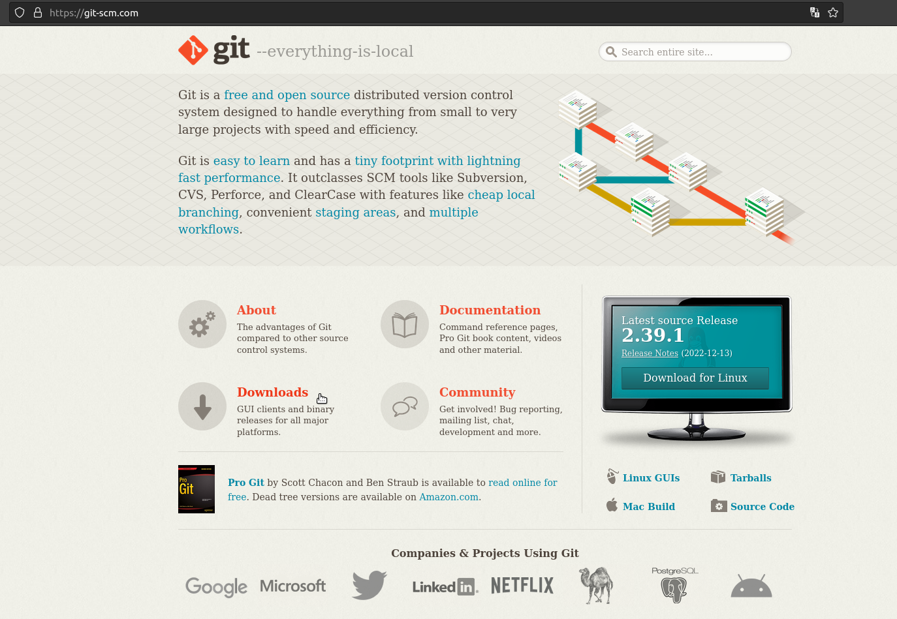
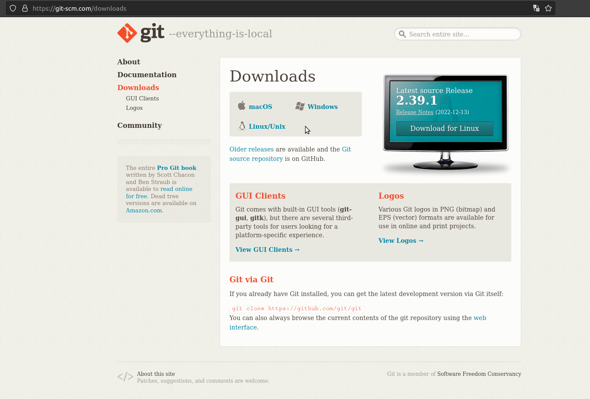
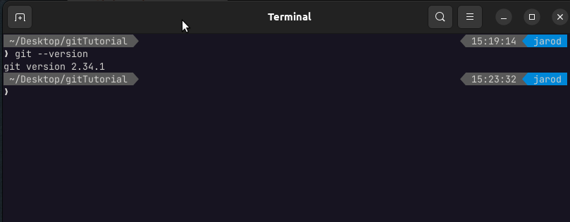

# Introducción

---

## ¿Qué es GIT?

Git es un software de control de versiones distribuido, gratuido y de código abierto, diseñado para gestionar con rapidez y eficiacia todo tipo de proyectos.

Para tenerlo disponible se debe descargar desde su página oficial, y está disponible para diferentes sistemas operativos.

Funciona principalmente por comandos desde cualquier terminal una vez haya sido instalado.  Aunque también existen entornos gráficos y/o extensiones para diferentes editores de textos.

Aquí nos centraremos a utilizar linea de comandos.

## Página Oficial

[Enlace a Página Oficial](https://git-scm.com/)

[Enlace de Descarga desde su página oficial](https://git-scm.com/downloads)

## Primeros Pasos

Una vez que ya haya sido instalado **(Instalar el software con la configuración por defecto)** podemos verificar qué versión tenemos instalada y ademas nos aseguraremos que la instalación fue correcta.

1. Primero debemos abrir una terminal(cmd en windows, o consola de comandos)
2. Ingresaremos nuestro primer comando

.

    git --version

La Terminal mostrará una respuesta similar a esta:

Listo GIT ya se encuentra diponible para ser utilizado.

## TAREA:

Crear una cuenta en **GITHUB** que es una plataforma para almacenar código, (existen otrás más como **GITLAB**) pero haremos pruebas con GITHUB.
