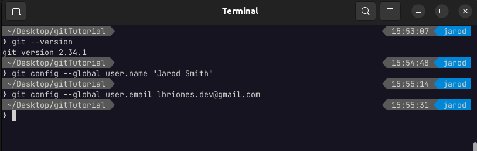
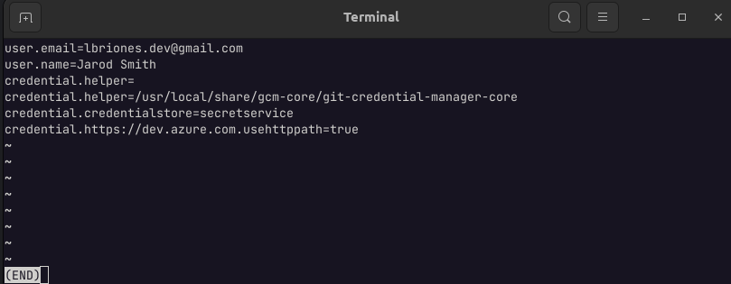

# Configurando GIT

---

GIT puede aceptar varias configuraciones pero la siguiente será la más básica

Esto establece tu nombre de usuario

    git config --global user.name "Jarod Smith"

Esto establece tu correo electrónico

    git config --global user.email lbriones.dev@gmail.com

Asegurense de poner **sus datos**, lo anterior son solo ejemplos.

## ¿Cómo puedo ver la configuración de GIT?

    git config --list

**Para poder salir de la pantalla que mostrará debes presionar la letra '*Q*'**

