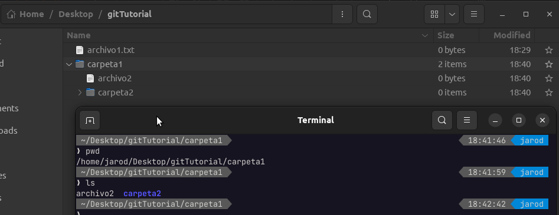

# Primeros Comandos

---

## Listar directorio o carpeta

    ls

Esto permite listar tanto como archivo o carpetas que se encuentren en el directorio actual

## Saber en qué carpeta o directorio me encuentro

    pwd

Este comando mostrará la ruta en la que se encuentra el directorio activo

## Moverse entre directorios

Para moverse entre directorios es necesario utilizar el comando **cd**, sin embargo este comando necesita el nombre de la carpeta/directorio al cual moverse, por ejemplo si deseo entrar a **carpeta1** que se encuentra en este directorio, el comando sería.

    cd carpeta1

Esto hará que el directorio activo cambie a **carpeta1**

## Salir del directorio activo

Para lograr salir del directorio activo y volver al directorio anterior de la jerarquía debo utilizar el comando

    cd ..

## Crear carpeta por terminal

Para crear un directorio/carpeta se debe utilizar el comando **mkdir** seguido del nombre que le queremos dar

    mkdir miCarpeta

## Por fin!! con esto ya tenemos lo suficiente para movernos entre directorios y utilizar los primeros comandos de GIT.

**TAREA:** entrar al directorio recien creado por terminal