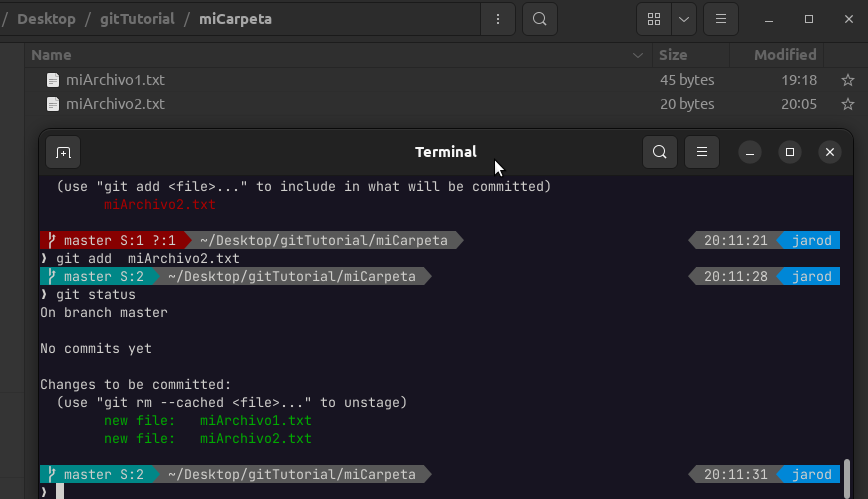

# Trabajando con GIT

---

## Inicializar un directorio

    git init

Esto hará que el directorio activo se convierta en un repositorio local y git comenzará a vigilar cualquier cambio que se produzca en él.

## Flujo de trabajo GIT

## Revisar el estado de trabajo de GIT

Para el siguiente ejemplo crearemos un archivo llamado **miArchivo.txt** y en su interior escribiremos cualquier texto y lo guardaremos.

Acto seguido en la terminal usaremos el siguiente comando

    git status

Git status nos informa el estado actual de nuestro repositorio y lo hace mostrando de color rojo **cuales son los archivos han tenido cambios** y que no está "siguiendo", git no sigue todos los archivos, **sólo los cuales** hayas indicado hacerlo, y para hacerlo nos lleva al siguiente comando.

## Añadir archivos al Stage

Como ya se habia indicado los archivos que tienen cambios se deben "mover" al siguiente "stage" o  "pasarlo a una siguiente etapa" y esto se hace con el comando **git add**, sin embargo git add recibe un argumento que es el nombre del archivo que quieres que se "suba", o también puede ser una expresión regular por ejemplo "*.txt" esto hará que todos los archivos con extensión txt se subirán o puedes utilizar ".", esto hará que todos los archivos marcados en rojo se subirán.

    git add miArchivo.txt

En este punto podemos ver en color verde los archivos que se encuentran en la etapa de "stage", en otras palabras, se encuentran listos para ser comprometidos

Ahora vamos a crear otro archivo llamado **miArchivo2.txt** y escribiremos en el cualquier texto, y volveremos a escribir el comando **git status**

    git status

Aqui podemos ver que **miArchivo1.txt** está siendo vigilado por GIT, sin embargo **miArchivo2.txt** no lo está haciendo, lo añadiremos al "stage"

    git add miArchivo2.txt
    git status

Ahora podemos ver que ambos archivos están en la etapa de **stage**, ahora haremos una modificación en **miArchivo1.txt**, abriremos el archivo y modificaremos su texto y guardaremos.

Aquí sucede algo, **miArchivo1.txt** está de color verde significa que tiene modificaciones ya listas en el stage, sin embargo también está siendo marcado de color rojo, esto significa que el arhivo tiene cambios que no han sido considerados para la etapa de stage, **debemos refrescar los cambios** con el comando **git add**

    git add miArchivo1.txt
    git status

Ahora tenemos el stage actualizado con los archivos a los ultimos cambios realizados.

## Primer Commit

Para realizar un commit se debe tener archivo en el área de stage que se quieran comprometer y realizar el siguiente comando

    git commit -m "Este es el primer commit"

Donde el texto entre comillado, se refiere a un mensaje que sea descriptivo al cambio realizado en el/los archivos.

    git status

Aquí GIT nos muestra que el **"working area"** está limpia, esto quiere decir que ya no hay cambios y que los archivos que se encontraban en **"stage area"** fueron **"comprometidos"**

Continuando con el concepto de commit, ahora vamos a eliminar a **miArchivo2.txt**

    rm miArchivo2.txt
    git status
    git add miArchivo2.txt
    git status

Ahora haremos un commit, con este cambio realizado (eliminación de **miArchivo2.txt**)

    git commit -m "Eliminación de miArchivo2.txt"
    git status
    ls

## Quitar un archivo del Stage Area

Si por algún motivo nos arrepentimos de haber subido un archivo al **stage area** podemos quitarlo de ahi, y devolverlo al **working area**, siempre y cuando no hayamos hecho ya el **commit**

Ejemplo: eliminemos a **miArchivo1.txt**, añadiremos el cambio al stage área y luego mostraremos el estado del **working area**

    rm miArchivo.txt
    git add miArchivo.txt
    git status

Ahora quitaremos el archivo de la etapa de stage con el siguiente comando

    git restore --staged miArchivo.txt
    git status

Aquí podemos ver que **miArchivo1.txt** ahora se encuentra en rojo, lo que significa que **no** está en el stage area, sino en el working area.

## Restaurar archivos

Ahora recuperaremos **miArchivo1.txt** ya que **descartaremos los cambios realizados**, actualmente **miArchivo1.txt** no está en el directorio.

    ls
    git restore miArchivo1.txt
    git status
    ls

## Renombrar Archivos

Para renombrar debemos utilizar el comando mv donde recibe 2 argumentos, el archivo original y el nombre al que cambiará

Ejemplo: Renombrar **miArchivo1.txt** a **archivo.txt**

    mv miArchivo1.txt archivo.txt
    ls

Aquí podemos apreciar que el archivo que se encuentra en el directorio se llama **archivo.txt**

    git status

Acá nos muestra que el archivo llamado **miArchivo1.txt** fue eliminado y ahora existe otro archivo llamado **archivo.txt** el cual no está siendo "vigilado" por git.  Lo que haremos es añadir al stage los dos archivos

    git add miArchivo1.txt archivo.txt
    git status

Ahora hagamos un "**commit**" para comprometer estos cambios

    git commit -m "Renombrando miArchivo1.txt a archivo.txt"

