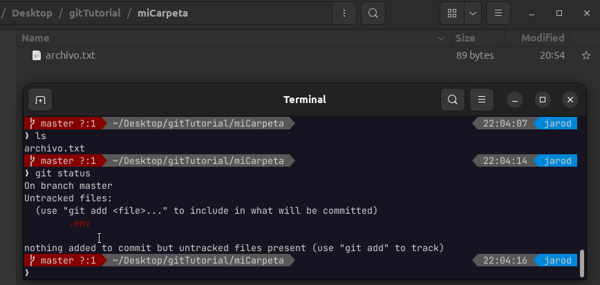
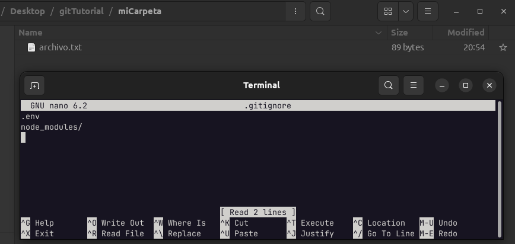
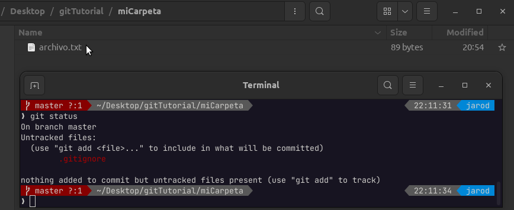
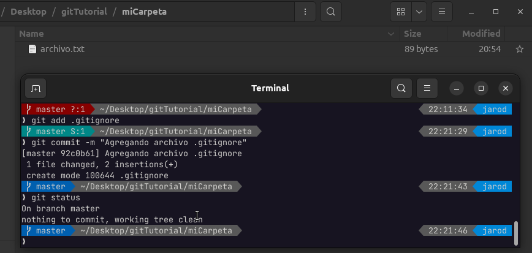
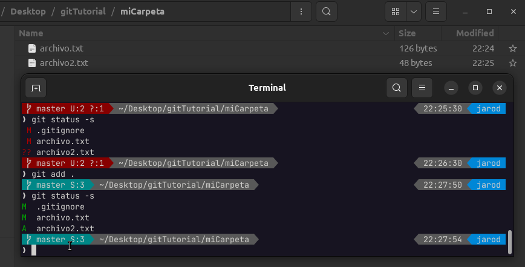

# Ignorando Archivos

---

Aveces es necesario indicarle a GIT que **ignore** algunos archivos para que no se suban a ningún repositorio, por ejemplo: variables de entorno o algún fichero de configuración exclusivo de nuestro computador.

Para esto simularemos el siguiente caso: Voy a crear un archivo .env (archivo de variables de entorno) en donde se configuran contraseñas para las distintas conexiones a aplicaciones y este archivo no deseo que sea subido al repositorio por error, ya que posee datos bastante sensibles.

    git status

Como podemos ver GIT detecta un nuevo archivo y nos está avisando que no se está siguiendo sus cambios (nada nuevo hasta aquí), pero lo que deseamos es que GIT completamente lo **IGNORE** y no me esté avisando en cada momento.  Para eso debemos crear un archivo llamado **.gitignore** dentro del mismo proyecto.

Una vez creado dentro del archivo **.gitignore** se debe especificar el/los archivos que deseamos que ignore o rutas o directorios.

En la imagen se especificó que deseamos que **ignore** el archivo **.env** y la carpeta **node_modules/**

    git status

Acá podemos apreciar que el archivo **.env** ya es ignorado por GIT y que ahora encuentra un nuevo archivo llamado **.gitignore**, lo añadiremos a los cambios

    git add .gitignore
    git commit -m "Agregando archivo .gitignore"
    git status

## Status Corto

También es posible utilizar un flag al comando status para que el texto devuelto sea más corto

    git status -s

