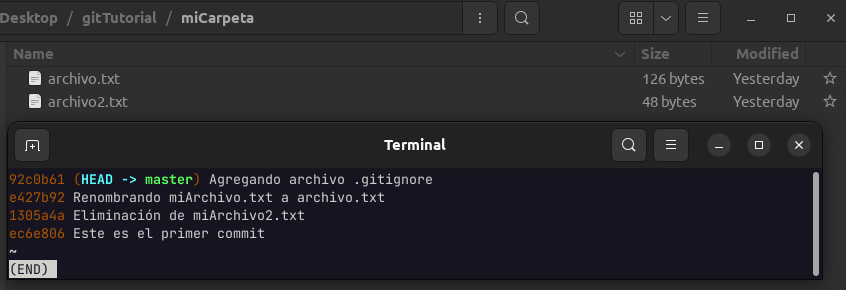

# Historial de GIT

---

## Git log

Para ver el hisotorial del repositorio existe el comando git log, sin embargo el formato que utiliza nos obliga a usar la barra espaciadora para ir "escroleando"

    git log

Lo bueno que existen "flags" que nos permite controlar la forma en que los muestra el historial el comando

    git log --oneline

