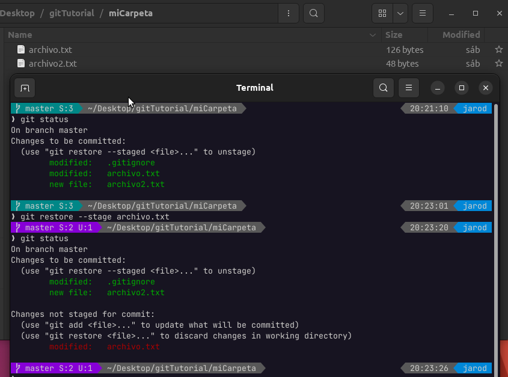
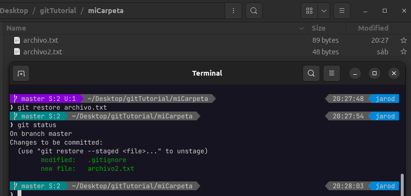
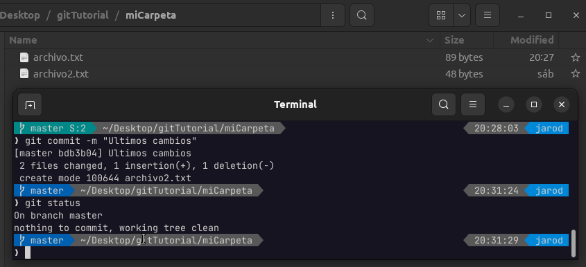

# Restaurar Archivo desde el Stage

---

¿Que pasaría si ya tengo un archivo en el stage y me arrepiento de hacer un commit con él?, solo debemos quitarlo del stage con el siguiente comando

    git restore --stage archivo.txt
    git status

En la image podemos ver que tenemos inicialmente 3 archivos en el stage, y luego de realizar el comando **git restore --stage archivo.txt** podemos apreciar que el archivo indicado **archivo.txt** ya no se encuentra en el stage y se pinta de color rojo.

Ahora finalmente puedo descartar definitivamente los cambios que existen en **archivo.txt**

    git restore
    git status

Con esto nos deshacemos de cualquier cambio que haya tenido **archivo.txt** dejando preparado el working directory para hacer el commit sólo de los archivos que necesito comprometer.

