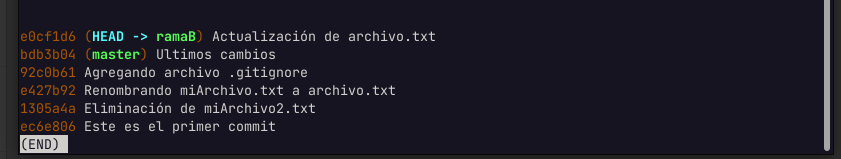

# Trabajando con ramas

---

## Saber en qué rama estoy trabajando:

    git branch

>Para poder salir de esta pantalla de debe presionar la **letra q**

## Crear una rama

    git checkout -b nombre_de_la_rama

    git branch

En esta imagen podemos apreciar que existen 2 ramas, la rama **master** y **ramaB** y que actualmente se encuentra seleccionada esta última.

Vamos a hacer una modificación en **archivo.txt** para luego crear un commit

Luego de esto revisaremos el historial

    git log --oneline

## Cambiar entre ramas

Ya podemos cambiarnos entre las ramas, y ahora podremos ver que un mismo archivo es totalmente diferente entre cada rama

## Mezclar/Fusionar Ramas

Cuando ya hemos trabajado en una rama, es posible unir la rama actual con la rama principal, para eso se debe estar en la rama principal y ejecutar el siguiente comando

    git merge ramaB

